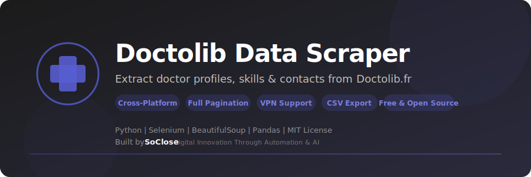

<p align="center">
  
</p>

<p align="center">
  <strong>Extract doctor profiles, skills & contacts from Doctolib.fr — automated scraping with clean CSV export.</strong>
</p>

<p align="center">
  <a href="LICENSE"></a>
  <a href="https://www.python.org/downloads/"></a>
  
  <a href="https://www.selenium.dev/"></a>
  <a href="https://github.com/SoCloseSociety/DoctolibDataScraper/stargazers"></a>
  <a href="https://github.com/SoCloseSociety/DoctolibDataScraper/issues"></a>
  <a href="https://github.com/SoCloseSociety/DoctolibDataScraper/network/members"></a>
</p>

<p align="center">
  <a href="#quick-start">Quick Start</a> &bull;
  <a href="#key-features">Features</a> &bull;
  <a href="#configuration">Configuration</a> &bull;
  <a href="#faq">FAQ</a> &bull;
  <a href="#contributing">Contributing</a>
</p>

---

## What is Doctolib Data Scraper?

**Doctolib Data Scraper** is a free, open-source **Doctolib.fr web scraper** built with Python and Selenium. It automates the extraction of doctor profiles from any Doctolib search URL into clean, analysis-ready CSV files.

Manually collecting doctor information from Doctolib is time-consuming. This scraper handles the entire process: give it a search URL, and it crawls all paginated results, then visits each profile to extract structured data — names, addresses, skills, degrees, and contact information.

### Who is this for?

- **Healthcare Recruiters** looking to build prospect lists of medical professionals
- **Market Researchers** studying the healthcare landscape in France
- **Data Analysts** collecting public health data for analysis
- **Startup Founders** building healthcare-related products and services
- **Researchers** studying medical specialization distribution
- **Developers** learning web scraping with Selenium and Python

### Key Features

- **Two-Phase Extraction** - Phase 1 crawls paginated results, Phase 2 scrapes each profile
- **Full Pagination** - Automatically navigates all search result pages
- **Multi-Location** - Extracts every practice location per doctor
- **VPN Rotation** - Built-in NordVPN CLI support to avoid rate limiting (optional)
- **Progressive Saving** - Data saved every 5 profiles, no data loss on crash
- **Auto-Recovery** - Handles connection drops with smart retry logic
- **Cross-Platform** - Works on Windows, macOS, and Linux
- **Clean CSV Output** - Ready for Excel, Google Sheets, or any data tool
- **Free & Open Source** - MIT license, no API key required

---

## Quick Start

### Prerequisites

| Requirement | Details |
|-------------|---------|
| **Python** | Version 3.9 or higher ([Download](https://www.python.org/downloads/)) |
| **Google Chrome** | Latest version ([Download](https://www.google.com/chrome/)) |
| **NordVPN** | Optional — for IP rotation during large scrapes |

### Installation

```bash
# 1. Clone the repository
git clone https://github.com/SoCloseSociety/DoctolibDataScraper.git
cd DoctolibDataScraper

# 2. (Recommended) Create a virtual environment
python -m venv venv

# Activate it:
# Windows:
venv\Scripts\activate
# macOS / Linux:
source venv/bin/activate

# 3. Install dependencies
pip install -r requirements.txt
```

### Usage

```bash
python main.py
```

Enter a Doctolib search URL when prompted:

```
============================================================
  DoctolibDataScraper
  by SoClose Society - https://soclose.co
============================================================

Enter Doctolib search URL: https://www.doctolib.fr/medecin-generaliste/paris
```

---

## How It Works

```
Doctolib Search URL
        │
        ▼
┌─────────────────────┐
│  Phase 1: Crawl     │──→ doctolib_profile_link.csv
│  Paginated results  │
└─────────────────────┘
        │
        ▼
┌─────────────────────┐
│  Phase 2: Scrape    │──→ doctolib_profile_details.csv
│  Each doctor profile │
└─────────────────────┘
```

---

## What It Extracts

| Data Field | Example |
|------------|---------|
| **Name** | Dr. Marie Dupont |
| **Addresses** | All practice locations with full addresses |
| **Skills** | Medical specializations, competencies |
| **Degrees** | Diplomas, certifications, education history |
| **Contacts** | Phone numbers, additional contact details |

### Output Files

| File | Content |
|------|---------|
| `doctolib_profile_link.csv` | All unique doctor profile links |
| `doctolib_profile_details.csv` | Full structured profile data |
| `scraper.log` | Timestamped execution log |

---

## Configuration

### NordVPN Setup (Optional)

VPN support helps avoid rate limiting during large scraping sessions.

<details>
<summary><strong>Windows</strong></summary>

1. Install [NordVPN](https://nordvpn.com/)
2. Add NordVPN to your PATH: `C:\Program Files\NordVPN\`
3. Verify in Command Prompt: `nordvpn -c`

</details>

<details>
<summary><strong>macOS</strong></summary>

1. Install NordVPN via [nordvpn.com](https://nordvpn.com/) or `brew install nordvpn`
2. Verify in Terminal: `nordvpn connect`

</details>

<details>
<summary><strong>Linux</strong></summary>

1. Install: `sh <(curl -sSf https://downloads.nordcdn.com/apps/linux/install.sh)`
2. Login: `nordvpn login`
3. Verify: `nordvpn connect`

</details>

---

## Tech Stack

| Technology | Role |
|------------|------|
| [Python 3.9+](https://www.python.org/) | Core language |
| [Selenium 4.15+](https://www.selenium.dev/) | Browser automation & page interaction |
| [BeautifulSoup4](https://www.crummy.com/software/BeautifulSoup/) | HTML parsing & data extraction |
| [Pandas](https://pandas.pydata.org/) | Data structuring & CSV export |
| [webdriver-manager](https://github.com/SergeyPirogov/webdriver_manager) | Automatic ChromeDriver management |

---

## Project Structure

```
DoctolibDataScraper/
├── main.py              # Main scraper application
├── requirements.txt     # Python dependencies
├── assets/
│   └── banner.svg       # Project banner
├── LICENSE              # MIT License
├── README.md            # This file
├── CONTRIBUTING.md      # Contribution guidelines
└── .gitignore           # Git ignore rules
```

---

## Troubleshooting

### Chrome driver issues

The bot uses `webdriver-manager` to automatically download the correct ChromeDriver. If you encounter issues:

```bash
pip install --upgrade webdriver-manager
```

### Rate limiting / IP blocks

If Doctolib blocks your requests:
1. Enable NordVPN rotation (see [Configuration](#nordvpn-setup-optional))
2. Increase delays between requests
3. Reduce the number of profiles per session

### Doctolib UI changes

Doctolib occasionally updates its web interface. If the scraper stops working:
1. Check the [Issues](https://github.com/SoCloseSociety/DoctolibDataScraper/issues) page for known problems
2. Open a new issue with the error message

### Permission denied errors (macOS/Linux)

```bash
chmod +x main.py
```

---

## FAQ

**Q: Is this free?**
A: Yes. Doctolib Data Scraper is 100% free and open source under the MIT license.

**Q: Do I need an API key?**
A: No. This tool uses browser automation (Selenium), so no API key or developer account is needed.

**Q: How many profiles can I scrape at once?**
A: There is no hard limit. The scraper processes profiles one by one with progressive saving. Just be mindful of Doctolib's usage policies and use VPN rotation for large scrapes.

**Q: Does it comply with GDPR?**
A: The tool extracts publicly available data. You are responsible for handling any collected data in compliance with GDPR and applicable laws.

**Q: Does it work on Mac / Linux?**
A: Yes. The scraper is fully cross-platform and works on Windows, macOS, and Linux.

---

## Alternatives Comparison

| Feature | Doctolib Data Scraper | Manual Copy-Paste | Paid Scraping APIs |
|---------|----------------------|-------------------|--------------------|
| Price | **Free** | Free | $50-200/mo |
| Automated pagination | Yes | No | Yes |
| Multi-location scraping | Yes | Manual | Varies |
| Open source | Yes | N/A | No |
| API key required | No | No | Yes |
| VPN rotation | Built-in | N/A | Varies |
| Cross-platform | Yes | Yes | Web only |

---

## Contributing

Contributions are welcome! Please read the [Contributing Guide](CONTRIBUTING.md) before submitting a pull request.

---

## License

This project is licensed under the [MIT License](LICENSE).

---

## Disclaimer

This tool is provided for **educational and research purposes only**. Use it responsibly and in compliance with [Doctolib's Terms of Service](https://www.doctolib.fr/terms) and applicable data protection laws (GDPR). The authors are not responsible for any misuse or consequences arising from the use of this software.

---

<p align="center">
  <strong>If this project helps you, please give it a star!</strong><br>
  It helps others discover this tool.<br><br>
  <a href="https://github.com/SoCloseSociety/DoctolibDataScraper">
    
  </a>
</p>

<br>

<p align="center">
  <sub>Built with purpose by <a href="https://soclose.co"><strong>SoClose</strong></a> &mdash; Digital Innovation Through Automation & AI</sub><br>
  <sub>
    <a href="https://soclose.co">Website</a> &bull;
    <a href="https://linkedin.com/company/soclose-agency">LinkedIn</a> &bull;
    <a href="https://twitter.com/SoCloseAgency">Twitter</a> &bull;
    <a href="mailto:hello@soclose.co">Contact</a>
  </sub>
</p>
